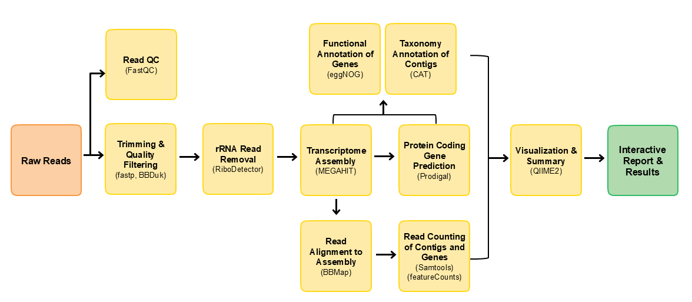

# About MGscan Metatranscriptome pipeline 
This pipeline is designed to conduct *de novo* metatranscriptome assembly and taxonomic and functional annotations of the assembly from NGS metatranscriptome data. Please find the sample report [here](https://zymo-research.github.io/pipeline-resources/reports/metatranscriptome_sample_report.html).

## Source of the pipeline
This pipeline was adapted from community-developed [nf-core/metadenovo](https://github.com/nf-core/taxprofiler) pipeline version 1.0.0. [Zymo Research](https://www.zymoresearch.com) made significant contributions in the adaption effort. This mainly include adding a removal of rRNA reads step, development and use of custom version of `CAT`, taxonomy plots and the improvement of the report.

## What is in the pipeline
This pipeline is built using [Nextflow](https://www.nextflow.io/). A brief summary of pipeline:

1. Read QC with [`FastQC`](https://www.bioinformatics.babraham.ac.uk/projects/fastqc/)
2. Performs read pre-processing
   - Adapter clipping trimming with [`TrimGalore`](https://github.com/FelixKrueger/TrimGalore)
   - Low complexity and quality filtering with [`bbduk`](https://jgi.doe.gov/data-and-tools/software-tools/bbtools/)
3. rRNA reads removal with [`RiboDetector`](https://github.com/hzi-bifo/RiboDetector)
4. *de novo* assembly with either [`MEGAHIT`](https://github.com/voutcn/megahit) or [`RNAspades`](https://cab.spbu.ru/software/rnaspades/)
5. Align reads back to assembly with [`BBmap`](https://sourceforge.net/projects/bbmap/)
6. Get read counts per contig with [`Samtools`](https://www.htslib.org/) and per gene with [`Featurecounts`](http://subread.sourceforge.net)
7. Gene prediction with [`Prodigal`](https://github.com/hyattpd/Prodigal)
8. Taxonomic annotation of contigs with a custom version of [`CAT`](https://github.com/MGXlab/CAT_pack)
9. Functional annotation of genes with [`eggNOG mapper`](https://github.com/eggnogdb/eggnog-mapper)
10. Merge taxonomic and read count results, draw composition bar plots with [Qiime2](https://qiime2.org/)
11. Present results in a report with [`MultiQC`](http://multiqc.info/)
    
For details, please find the source code [here](https://github.com/Zymo-Research/aladdin-metatranscriptome-assembly).

## Default pipeline parameters

#### Low complexity filtering (BBDuk)
`BBDuk` discards any read that has less than **0.3** in average entropy in a sliding window of **50bp**.

#### rRNA reads removal (RiboDetector)
The CPU version of `RiboDetector` is run with the average read lengths dynamically calculated before input. The rRNA classification method for paired end reads is set as **none**.

#### Assembly (Megahit)
The default assembler is `MEGAHIT` with all its default settings. The minimum contig length is **200bp**.

#### Align reads to assembly (BBmap)
The reads are aligned back to assembly using `BBmap` with the parameters `minid=0.9 idfilter=0.9 maxindel=20`. This means **minimum sequence identity of 90% and maximum insertion or deletion of 20bp**.

#### Gene prediction (Prodigal)
Gene prediction on contigs was run using `prodigal` with `-p meta` mode.

#### Taxonomy annotation (CAT)
Taxonomy annotation was done using a customized version of `CAT` found [here](https://github.com/MGXlab/CAT_pack). In short, the custom version compensates for seqeuences with bad taxonomies in the NCBI NR database. The database used, `20231120_CAT_nr` was downloaded from [CAT](https://github.com/MGXlab/CAT_pack) directly. The parameter used here are `-r 10 -f 0.5 --orf_support 0.9 --ignore_notax_hits`. Note that `-r 10 -f 0.5` are parameters from the original version of `CAT`. The other two parameters are added in the custom version. Please find details in its GitHub repo.

#### Functional annotation (eggNOG)
The database for eggNOG-mapper was downloaded using eggNOG's download_eggnog_data.py on May 2024.

All other steps are using the software's default settings.