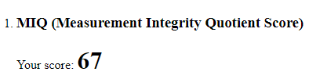
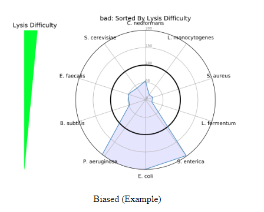
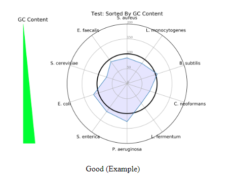
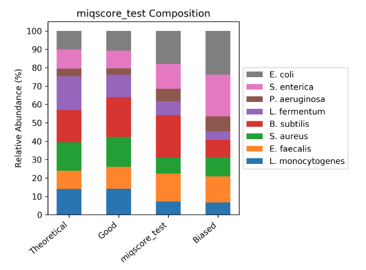
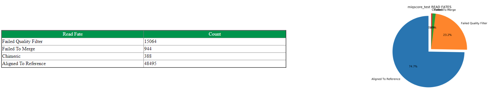

# Calculating your MIQ Score

The MIQ Score is a standardized score, that can be thought of as a college exam “grade”. Just as a college professor would grade your exam, the MIQ score report grades your samples and assigns a value between 0-100. Values of 90-99 constitute an excellent score, while 80-89 is a great score with 70-79 being average and so on. The “exam grade” is calculated based on the root mean squared of errors from the [ZymoBIOMICS Community Standard](https://www.zymoresearch.com/collections/zymobiomics-microbial-community-standards/products/zymobiomics-microbial-community-standard). The ZymoBIOMICS Community Standard has a manufacturing deviation of 15%. This means that if an organism in the control has an expected abundance of say 10, then acceptable values for the organismal range is within plus or minus 15% meaning that an abundance of 8.5 to 11.5 is acceptable. The 15% accounts for known manufacturing variability amongst all organisms in the mixed community. Using the root mean squared of errors, any deviation outside the known variability of 15% can be assumed to be caused by a workflow bias as opposed to a manufacturing bias. A MIQ score of 67, as shown below, is a below average score, meaning that whether in lysis, purification, or library preparation there is deviation from the expected values of the ZymoBIOMICS Microbial Community Standard that may be creating a bias in sample data.

# Interpretating Bias Detection (Radar) Plots

Incorporating the MIQ Score value along with the Bias Detection plots can provide useful information about a scientist’s workflow. Two different Bias Detection Plots will populate the report when the data is shotgun sequencing data, or just the first one when the data is 16S amplicon sequencing data. The first is a radar plot based on lysis difficulty. As seen in the figure below, the lysis difficulty increases from the bottom of the plot to the top of the plot with _E. coli_ being the easiest to lyse and _C. neoformans_ being the most difficult. The radar plot is helpful in detecting if a lysis method was able to uniformly lyse all organisms. The ZymoBIOMICS Community Standard includes organisms with a range of cell wall recalcitrance — some more difficult than others. If a radar plot populates like the figure below, there is a bias towards the easy to lyse organisms, or those with low cell wall recalcitrance. A workflow of this kind is not robust enough to effectively lyse all organisms and samples run alongside this positive control should be reevaluated due to a lysis bias.

The second radar plot that populates is one based on GC content (This only applys to the shotgun report). The ZymoBIOMICS Community Standard has a variety of GC content organisms ranging from 15% at the lowest, to 85% at the highest. The GC content radar plot is important because GC content can cause bias of sequencing coverage in a PCR-based library prep. In the plot below is a good example of a library preparation that is rather nonbiased, because there is an approximate equal spread of representation across all organisms. If the radar plot was widened towards a specific organism with more GC content, then there would be a bias of that organism in a workflow.

# Sample Composition Bar Plot

The MIQ Score report also generates the following compositional bar plot. The ZymoBIOMICS Community Standard samples will be displayed in the bar plot, with an example of a theoretical, good, user sample, and a biased workflow. In coordination with the MIQ Score “exam grade”, Bias Detection plots, and composition bar plots this graph allows for interpretation of potential biases in a workflow.

# Read Fate Counts

Read fates allow a user to see how many of the raw data reads align to the reference genomes of the ZymoBIOMICS Microbial Community Standard. The number of reads that aligned to the reference genome(or rRNA sequence), or poor quality reads, or those failed to merge or are chimeric(applies to 16S only), or those ambiguous between multiple genomes(applies to shotgun only) are compiled in a table. Each read fate will be divided by the total value of reads, giving a percentage to each read fate displayed in a pie chart on the final MIQ Score Analysis. Each metric provides insight into a potential workflow bias. A large proportion of reads filtering out of the analysis due to poor quality could indicate a possible failure of the sequencing run or library preparation steps. Reads that are of good quality but are unable to map to the Community Standard genome may suggest a potential contaminant in the sample. All of these values are best compared to other standard analyses run under the same conditions.

