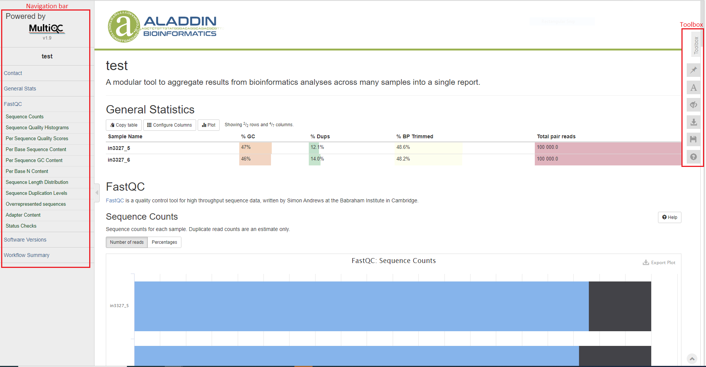
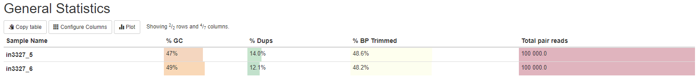
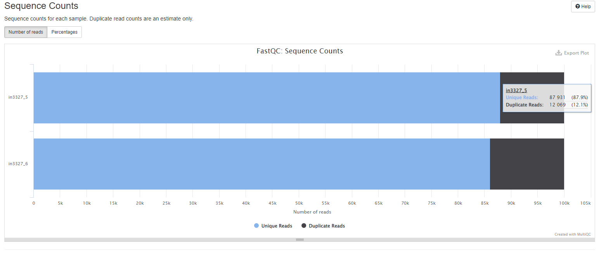
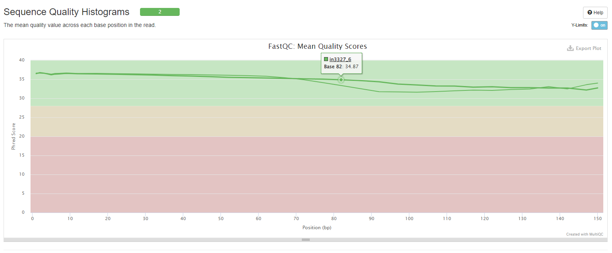
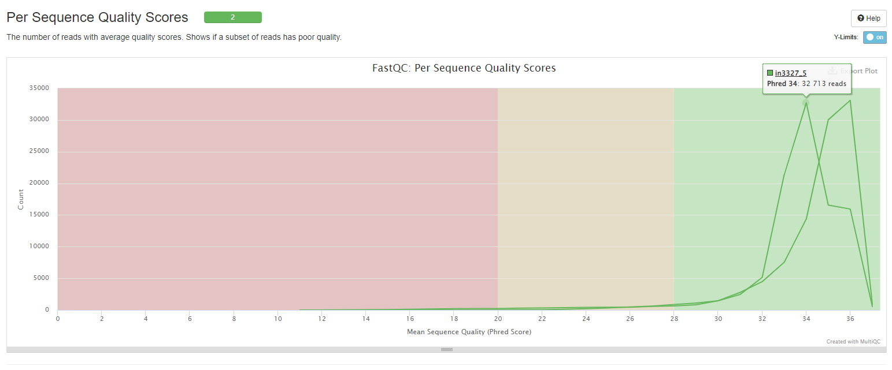
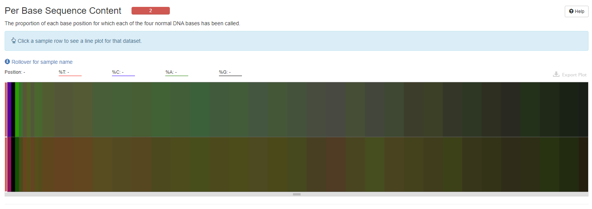
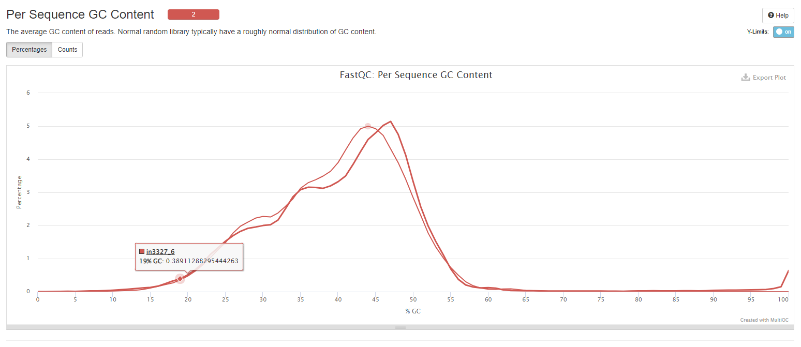
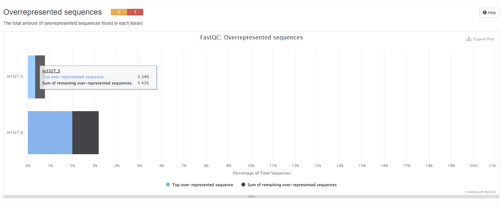
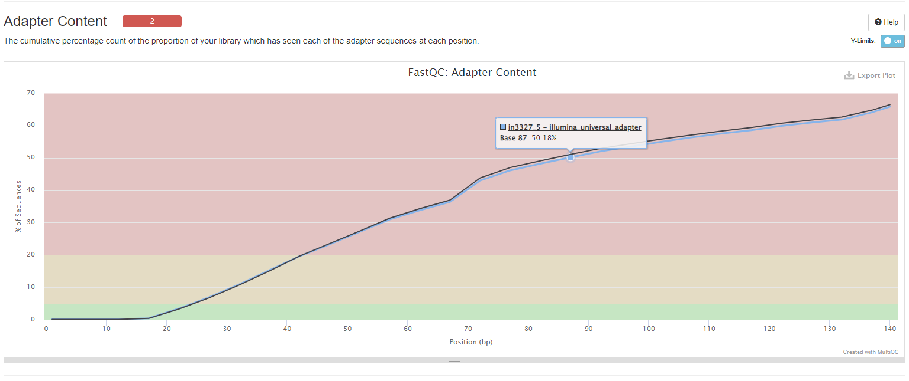
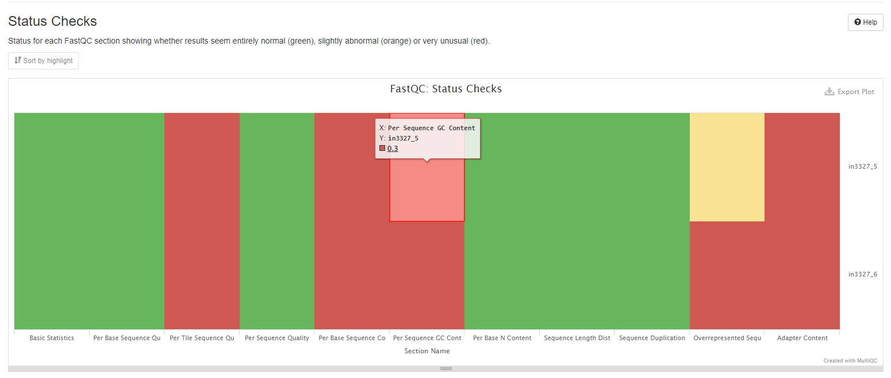

# How to interpret the bulk RNAseq report

This document describes how to understand the bioinformatics report generated by [Aladdin BSBolt pipeline](https://github.com/Zymo-Research/aladdin-bisulfitebolt). Most of the plots are taken from the [sample report](https://zymo-research.github.io/pipeline-resources/reports/BSBolt_sample_report.html). The sample report was generated using data from Zymo Research. The plots in your report might look a little different.

## Table of contents
* [Table of contents](#table-of-contents)
* [Report overview](#report-overview)
* [General Statistics](#general-statistics)
* [FastQC](#fastqc)
* [Cutadapt](#cutadapt)
  * [Trim Galore](#trim-galore)
  * [STAR](#star)
  * [RSeQC](#rseqc)
  * [QualiMap](#qualimap)
  * [Picard](#picard)
  * [Preseq](#preseq)
  * [DupRadar](#dupradar)
  * [ERCC expression vs concentration](#ercc-expression-vs-concentration)
  * [Biotype Counts](#biotype-counts)
  * [featureCounts](#featureCounts)
* [Comparison of samples](#comparison-of-samples)
  * [Sample distance and similarity](#sample-distance-and-similarity)
    * [Sample Similarity](#sample-similarity)
    * [MDS plot](#mds-plot)
  * [Top gene expression patterns](#top-gene-expression-patterns)
  * [Differential gene expression](#differential-gene-expression)
  * [Gene set enrichment analysis](#gene-set-enrichment-analysis)
* [Download data](#download-data)
* [Pipeline information](#pipeline-information)
  * [Software versions](#software-versions)
  * [Workflow summary](#workflow-summary)

## Report overview
The bioinformatics report is generated using [`MultiQC`](https://multiqc.info/). There are general instructions on how to use a MultiQC report on [MultiQC website](https://multiqc.info/). The report itself also includes a link to a instructional video at the top of the report. In general, the report has a navigation bar to the left, which allows you to quickly navigate to one of many sections in the report. On the right side, there is a toolbox that allows to customize the appearance of your report and export figures and/or data. Most sections of the report are interactive. The plots will show you the sample name and values when you mouse over them.

## General Statistics
[The general statistics table](https://zymo-research.github.io/pipeline-resources/reports/BSBolt_sample_report.html#general_stats) gives an overview of some important stats of your samples. For example, how many reads were in each sample, percentage of GC content, etc. These stats are collected from different sections of the report to give you a snapshot. This is usually the quickest way for you to evaluate how your bisulfite sequencing experiment went. 

Other information you can get from this tables are (from left to right):
1. Numbers of reads. Make sure they are as expected.
2. GC content of reads. Make sure they are consistent with your organism of interest and there are no large differences between samples, unless expected.
3. Percentages of reads that are duplicates. High duplication rate doesn't necessarily signal problems.

## FastQC
[FastQC](http://www.bioinformatics.babraham.ac.uk/projects/fastqc/Help/) gives general quality metrics about your reads. 

### Sequence Counts
This plot show the total number of reads, broken down into unique and duplicate. Tabs provide both counts and percentages view. Duplicate read counts are an estimate only.

### Sequnce Quality Histograms
This plot provides information about the mean quality score distribution across your reads.

### Per Sequence Quality Scores
This histogram shows number of reads against average quality scores for examining if a subset of reads has poor quality.

### Per Base Sequence Content
The heatmap shows the base composition (%A/C/G/T) of each sample. Clicking on a sample track will show the data for that sample as a line plot. 

### Per Sequence GC Content
The line plot shows average GC content of reads. Normal random library typically have a roughly normal distribution of GC content.

### Per Base N Content
This graph shows the percentage of base calls at each position for which an N was called. If a sequencer is unable to make a base call with sufficient confidence then it will normally substitute an N rather than a conventional base call. 

### Overrepresented Sequences
The plots show the total amount of overrepresented sequences found in each library.

### Adapter Content
The plot shows a cumulative percentage count of the proportion of your library which has seen each of the adapter sequences at each position. Once a sequence has been seen in a read it is counted as being present right through to the end of the read so the percentages you see will only increase as the read length goes on.
Note that only samples with ≥ 0.1% adapter contamination are shown.

### Status Checks
This heatmap summarises all of FastQC content into a single heatmap for a quick overview. Note that not all FastQC sections have plots in MultiQC reports, but all status checks are shown in this heatmap.

