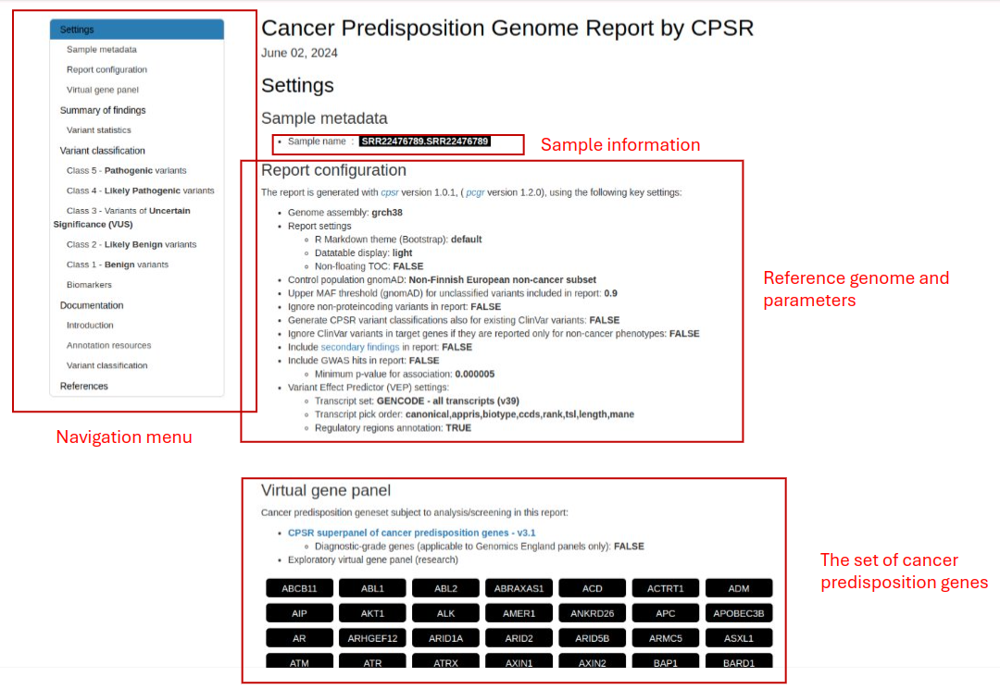
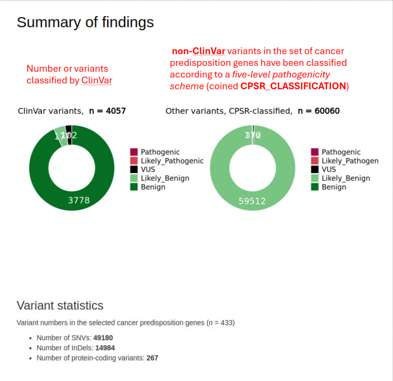
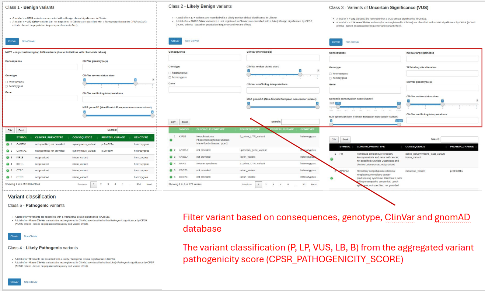
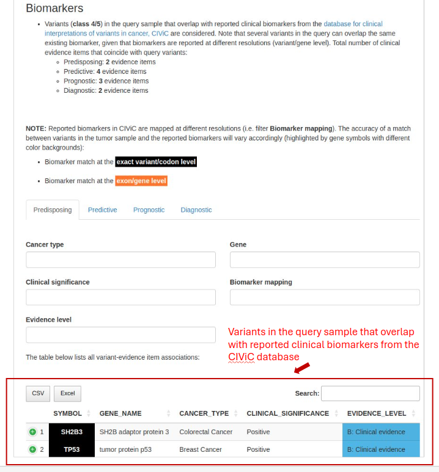
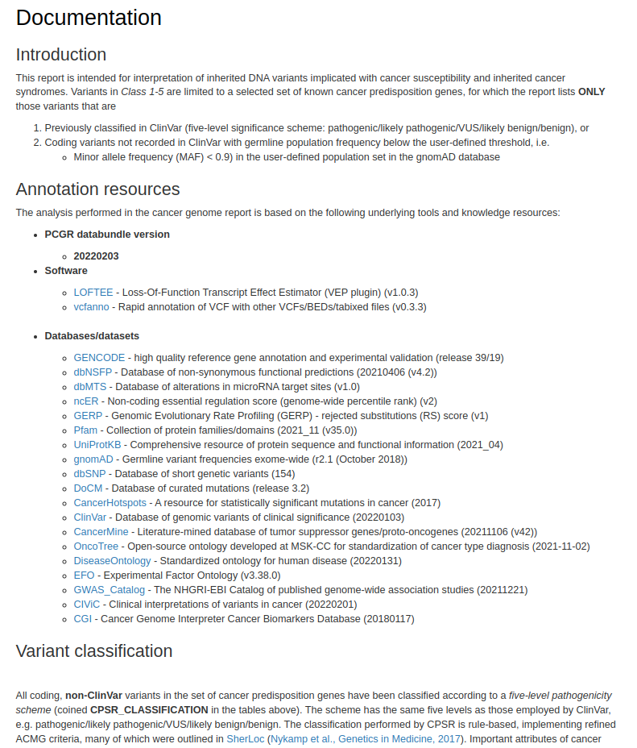

# How to Read the CPSR Report

[The Cancer Predisposition Sequencing Reporter (CPSR)](https://sigven.github.io/cpsr/) is a comprehensive tool designed to analyze genetic variants that may predispose individuals to cancer. This guide will help you understand the various sections of the report and how to interpret the information provided. The sample report could be found [here](../reports/cpsr_sample_report.html). It was generated using public data from [this paper](https://bmcbioinformatics.biomedcentral.com/articles/10.1186/s12859-020-03934-3).

For further information, please check out the following resources:
- [CPSR Output Documentation](https://sigven.github.io/cpsr/articles/output.html)
- [CPSR Annotation Resources](https://sigven.github.io/cpsr/articles/annotation_resources.html)

## Overview of CPSR

**Purpose:**
- CPSR focuses on identifying genetic variants that may predispose individuals to cancer.
- It provides insights into hereditary cancer syndromes by analyzing germline mutations.

**Types of Variants:**
- **Germline Variants:** Inherited variants present in the DNA of all cells of an individual. They can be passed down to offspring.
- **Pathogenic and Likely Pathogenic Variants:** Variants known or likely to cause an increased risk of cancer.
- **Variants of Uncertain Significance (VUS):** Variants whose association with cancer risk is not well understood.

## Key Features

### Clinical Interpretation
- The report categorizes variants based on their clinical significance using established guidelines from the American College of Medical Genetics and Genomics (ACMG).
- Provides information on the potential impact of identified variants on cancer risk.

### Gene Panels
- CPSR utilizes predefined gene panels that include genes known to be associated with hereditary cancer syndromes (e.g., BRCA1, BRCA2 for breast and ovarian cancer).

### Annotation and Classification
- Variants are annotated and classified based on their predicted impact on protein function and their relevance to cancer.
- Uses databases such as ClinVar, OMIM, and others to provide context on the clinical relevance of variants.

## Report Components

### Settings
- Background information including `Sample metadata`, `Report configuration`, and `Virtual gene panel`.

### Summary of Findings
- An overview of the key genetic findings, including pathogenic variants and their associated cancer risks.

### Variant Details
- Detailed information on each identified variant, including its genomic coordinates, predicted impact, and evidence supporting its classification.

- The section provides a summary of the total number of clinical evidence items associated with query variants, categorized based on their clinical implications (predisposing, predictive, prognostic, diagnostic).

### Documentation
The provided section of the CPSR report explains the purpose and methodology behind it, detailing how inherited DNA variants associated with cancer susceptibility are classified and analyzed. It highlights the following key points:

- Variant Classification: Only includes variants previously classified in ClinVar or those with low germline population frequency in the gnomAD database.

- Annotation Resources: Lists the software tools and databases used for variant annotation and classification, ensuring high-quality and comprehensive analysis.

- Variant Classification System: Explains the five-level pathogenicity scheme used to classify variants, based on refined ACMG criteria and other scientific sources.

- Calibration of Classification Thresholds: Describes how thresholds for variant classification were calibrated using high-quality ClinVar-classified variants.

- ACMG Criteria: Lists specific ACMG criteria used for variant classification, along with their respective scores contributing to benign or pathogenic classifications.

- References: Provides citations to key literature and databases supporting the methodology and findings of the report.

- Disclaimer: Includes a medical disclaimer indicating that the report is for research purposes only and should not be used for clinical decision-making.

