# How to interpret the Genomics report 

This document describes how to understand the bioinformatics report generated by [Aladdin Genomics pipeline](https://github.com/Zymo-Research/aladdin-genomics). Most of the plots are taken from the [sample report](https://zymo-research.github.io/pipeline-resources/reports/aladdin_genomics_sample_report.html). The sample report was generated using public data from [this paper](https://bmcbioinformatics.biomedcentral.com/articles/10.1186/s12859-020-03934-3). The plots in your report might look slightly different.

## Table of contents 

1. [Report overview](#report-overview) 
2. [General statistics table](#general-statistics-table)
3. [Sample processing](#sample-processing)
   - [FastQC](#fastqc) 
   - [FastP](#fastp) 
   - [GATK MarkDuplicates](#gatk-markduplicates) 
   - [Samtools Flagstat](#samtools-flagstat) 
   - [Mosdepth](#mosdepth)
4. [Variant Calling](#variant-calling)
   - [GATK BQSR](#gatk-bqsr)
   - [BCFtools](#bcftools)
   - [VCFtools](#vcftools)
5. [Variant information and potential impact (VEP)](#variant-information-and-potential-impact-vep)
6. [Pipeline information](#pipeline-information)
   - [Methods Description](#methods-description)
   - [Software versions](#software-version)
   - [Workflow summary](#workflow-summary)

## Report overview 

The bioinformatics report is generated using MultiQC. There are general instructions on how to use a MultiQC report on [MultiQC website](https://multiqc.info/docs/reports/reports/). The report itself also includes a link to an instructional video at the top of the report. In general, the report has a navigation bar to the left, which allows you to quickly navigate to one of many sections in the report. On the right side, there is a toolbox that allows you to customize the appearance of your report and export figures and/or data. Most sections of the report are interactive. The plots will show you the sample name and values when you mouse over them.

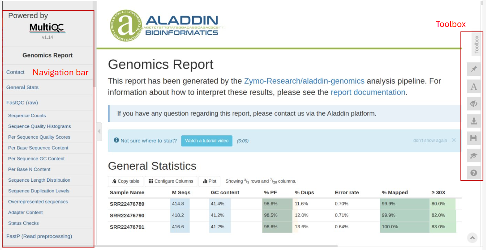

## General statistics table 

The general statistics table gives an overview of important stats for your samples. For example, it includes the GC content after filtering, the duplicate percentage of reads, the error rate (mismatches per bases mapped), and the fraction of the genome with at least 30X coverage. These stats are collected from different sections of the report to give you a snapshot. This is usually the quickest way to evaluate how your experiment went. Here are a few important things to look for when reading this table:

- \% Dups: Percentage of duplicate reads. High duplication rates can indicate PCR over-amplification, which might skew results. Typically, values below 10% are acceptable.
- \%Mapped: This shows the rate at which most of your reads are mapped to the reference genome. At least a 50% alignment rate should be expected for a successful genomics experiment. A low unique alignment rate often indicates inefficient DNA extraction and/or contamination with foreign organisms in your samples.
- ≥ 30X (Q30 Scores): Fraction of the genome with at least 30X coverage. Higher percentages (\>80%) indicate high-quality sequencing data.

Other information you can get from this table includes (from left to right):
- GC Content: Should be consistent with expected values for the organism studied.
- Error Rate (mismatches per bases mapped)
- Percent Reads Passing Filter (%PF)

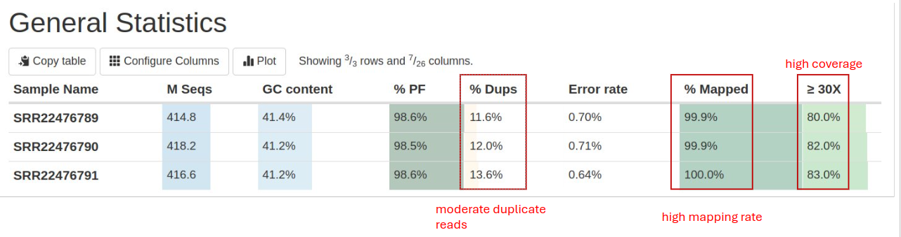

## Sample processing

### FastQC

[FastQC](https://www.bioinformatics.babraham.ac.uk/projects/fastqc/) provides several quality metrics:  the quality score distribution across your reads (in section `Sequence Quality Histograms`), the per base sequence content (\%A/C/G/T)(in section `Per Base Sequence Content`). You get information about adapter contamination (in section `Adapter Content`) and other overrepresented sequences (in section `Overrepresented sequences`). Some sections will sometimes issue warnings that your samples failed QC. It is important to remember that these QC metrics are from the raw reads, and there are often reasonable explanations why the raw reads failed these QC. One frequent warning you might see is in the Per Base Sequence Content section (see below). The presence of adapter sequences at 5' or 3' end could trigger these warnings. These adapter sequences are trimmed off before alignment, so there is no need to worry about them in the raw reads.

- `Per Sequence Quality Scores`: Assesses the quality score across all bases. A high-quality score (above 30) indicates good quality reads.

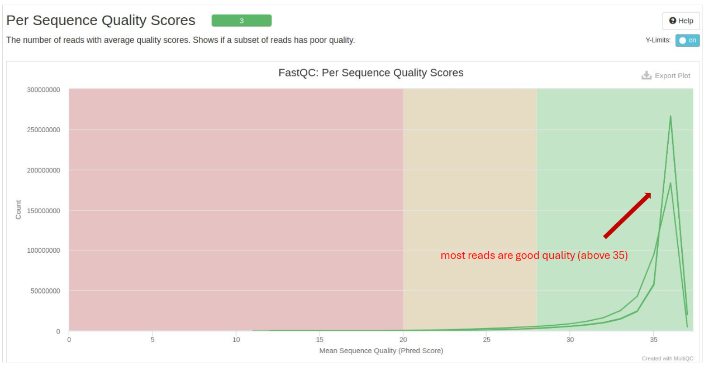

- `Per Sequence GC Content`: The distribution of GC content across reads. It should follow a normal distribution.

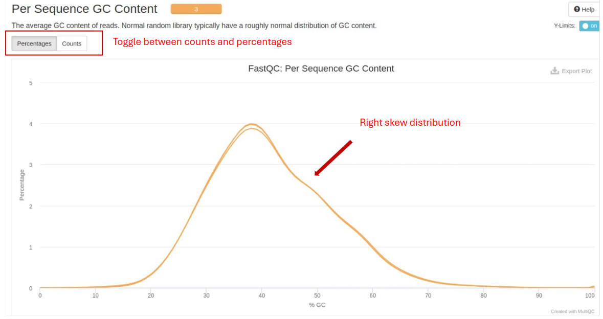

- `Sequence Duplication Levels`: Indicates the level of duplicate reads. High duplication levels could point to biased library preparation.

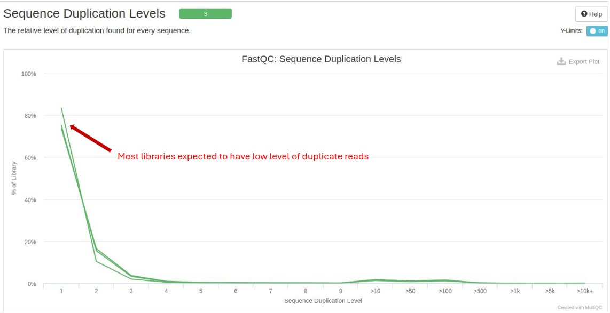

### FastP

[FastP](https://github.com/OpenGene/fastp) is used for data pre-processing, including quality filtering and adapter trimming. Important metrics include:
- Read Length Distribution: Displays the distribution of read lengths post-filtering. Consistent lengths are generally desired.
- Base Quality Distribution: Post-trimming quality scores should remain high across all bases.

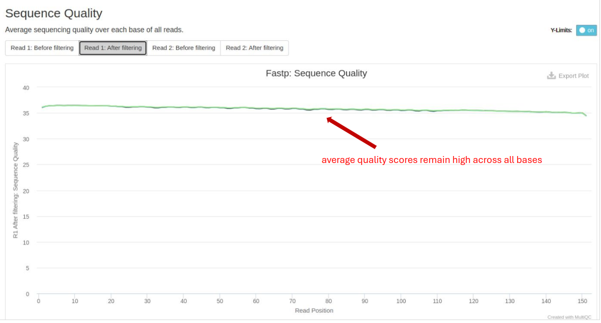

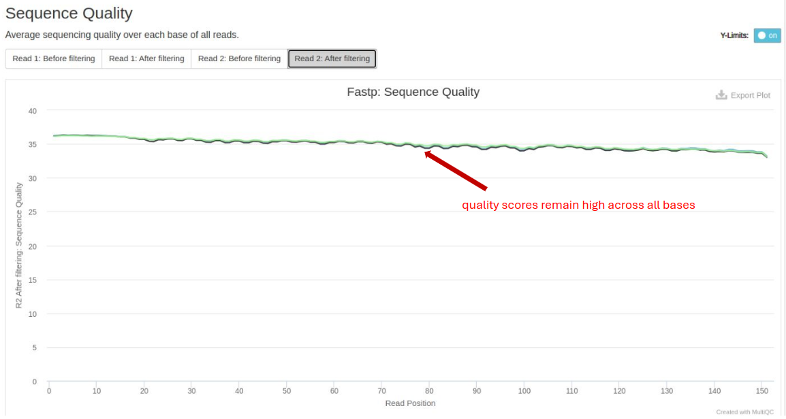

### GATK MarkDuplicates

[GATK MarkDuplicates](https://gatk.broadinstitute.org/hc/en-us/articles/360037052812-MarkDuplicates-Picard) is used to identify and flag duplicate reads. It improves the accuracy of downstream analyses such as variant calling by reducing the impact of PCR duplicates and sequencing artifacts:
- Duplicate Reads: The percentage of reads marked as duplicates. Ideally, this should be low to avoid biases in variant calling such as PCR or sequencing artifacts.

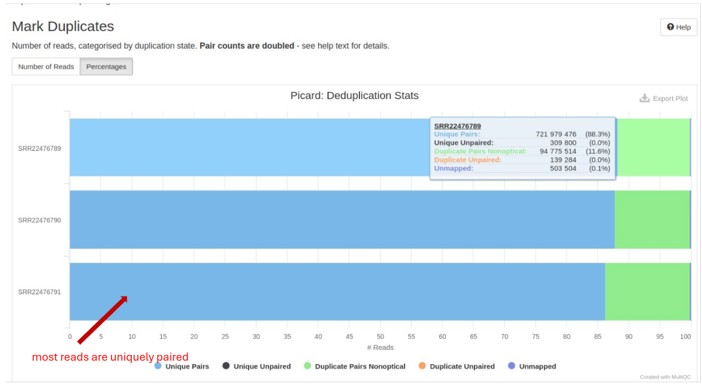

### Samtools Flagstat

[Samtools Flagstat](https://www.htslib.org/doc/samtools-stats.html) generates a statistical summary of various attributes of sequence alignment files, including the total number of reads, number of properly paired reads, number of singletons, and mapping quality.
- Mapped Reads: The percentage of reads successfully aligned to the reference genome. High alignment rates indicate good quality sequencing and mapping.
- Properly Paired Reads: Indicates reads that are correctly paired. High percentages are expected in paired-end sequencing.

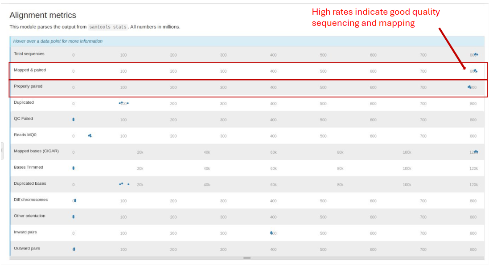

### Mosdepth

[Mosdepth](https://github.com/brentp/mosdepth) performs fast BAM/CRAM depth calculation for WGS, exome, or targeted sequencing. It provides coverage statistics:
- Coverage Depth: Higher coverage is generally better, providing more confidence in variant calling.

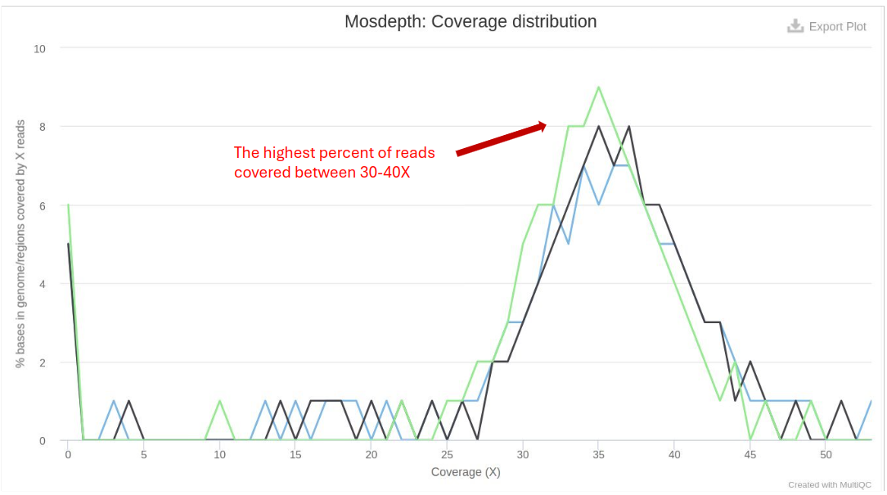

- Coverage Breadth: The percentage of the genome covered at various depths (e.g., 1x, 10x, 30x).

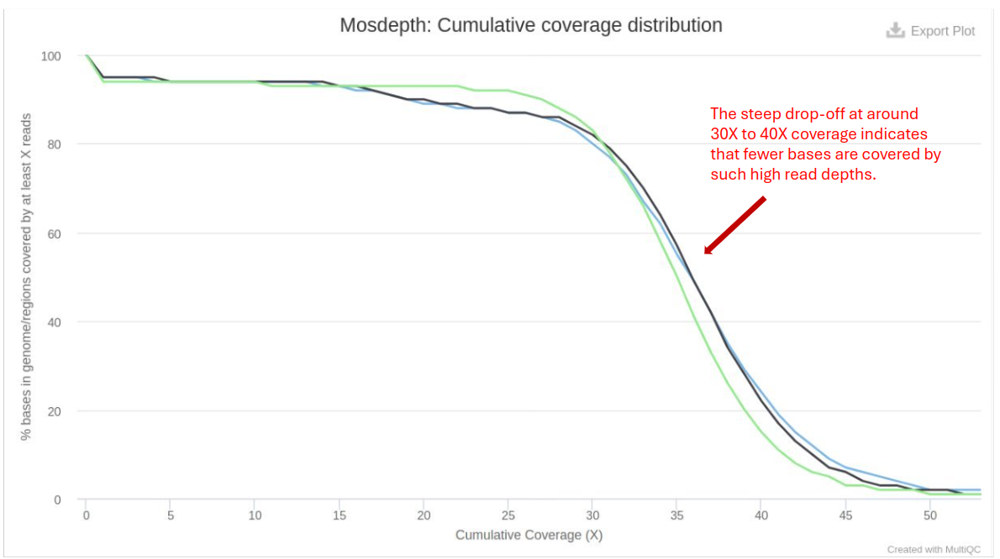

## Variant Calling
This section describes the processing and results of identifying variants (e.g., Single Nucleotide Polymorphisms - SNPs, Insertions - Deletions - INDELs) in the genome. Variant calling is performed using [GATK(broadinstitute.org)](https://gatk.broadinstitute.org/hc/en-us), a popular toolkit offering a wide variety of tools with a primary focus on variant discovery and genotyping.

### GATK BQSR

[GATK BQSR (Base Quality Score Recalibration)](https://gatk.broadinstitute.org/hc/en-us/articles/360035890531-Base-Quality-Score-Recalibration-BQSR) involves recalibrating the base quality scores to improve the accuracy of variant calls produced by tools like GATK.
- Before and After BQSR: Compare the quality score distributions before and after recalibration to assess improvements.
- Recalibrated Quality Scores: Should be high, indicating accurate base calling post-recalibration.

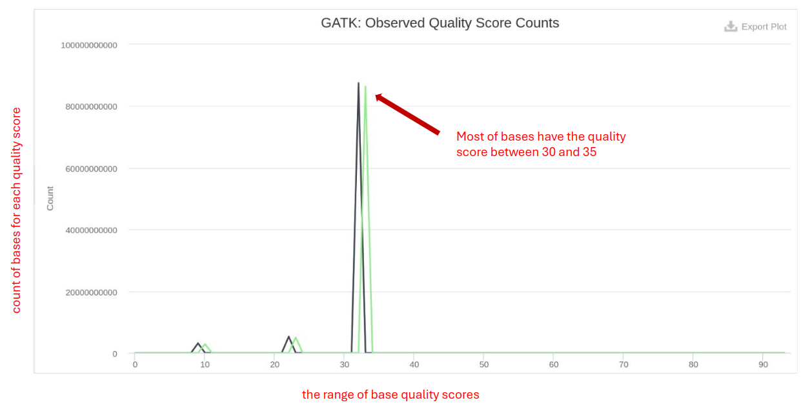

### BCFtools

[BCFtools](https://samtools.github.io/bcftools/) contains utilities for variant calling and manipulating VCFs and BCFs. It offers functions to detect genetic variants, including SNPs, INDEL, and Transition/Transversion (Ts/Tv) from aligned sequencing data (in BAM format). By allowing the comparison and integration of variant call sets across multiple samples, it facilitates the identification of shared and unique variants among different datasets.
- Variant Counts: Number of SNPs and indels called. Consistency with expected variant rates is important.

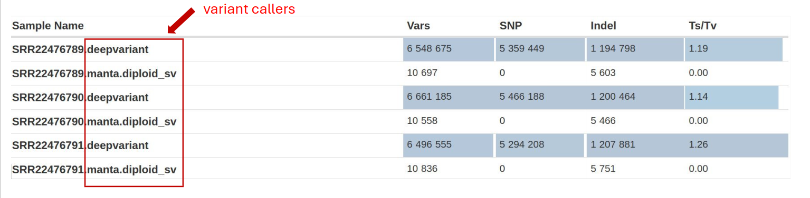

- Variant Quality Count: Number of variants passing quality filters. High pass number indicate good variant quality.

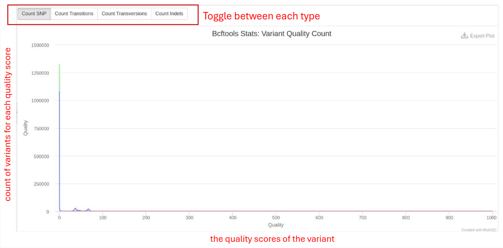

### VCFtools

[VCFtools](https://vcftools.sourceforge.net/) is a program for working with and reporting on VCF files. It is used for further analysis of variant calls and enables the filtering of Ts/Tv based on quality and counts, which helps in selecting high-confidence variants and removing potential false positives or artifacts. Researchers often empirically determine the threshold based on the quality distribution of the SNPs in their dataset. Commonly used thresholds are Q20, Q30, etc., corresponding to error probabilities of 1 in 100 and 1 in 1000, respectively. Bioinformatics tools like VCFtools allow users to specify a minimum quality threshold for filtering SNPs. For instance, setting a threshold of Q30 would filter out all SNPs with a Phred quality score below 30.  The expected Ts/Tv ratio for a typical human genome is around 2:1 to 3:1 in coding regions and approximately 1:1 in non-coding regions.

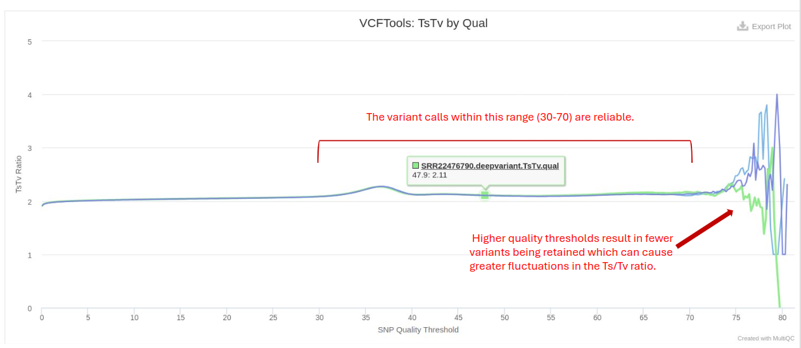

## Variant information and potential Impact (VEP)
[Variant Effect Predictor (VEP)](https://github.com/Ensembl/ensembl-vep) determines variants' effects on genes, transcripts, protein sequences, and regulatory regions. VEP is utilized to annotate variants in VCF files and predict their functional consequences. It provides variant information, including chromosome position, reference and alternate alleles. VEP also predicts the potential impact of genetic variants on genes and proteins by classifying them into different functional categories.
- Variant Consequences: Identifies whether variants are synonymous, missense, or nonsense, which impacts gene function.

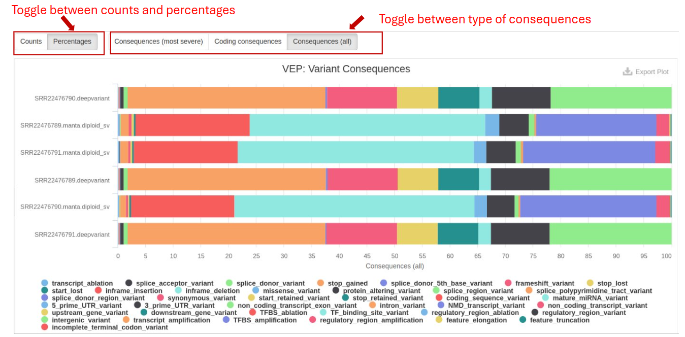

- Predicted Impact: Tools like SIFT and PolyPhen provide scores predicting the deleteriousness of variants.

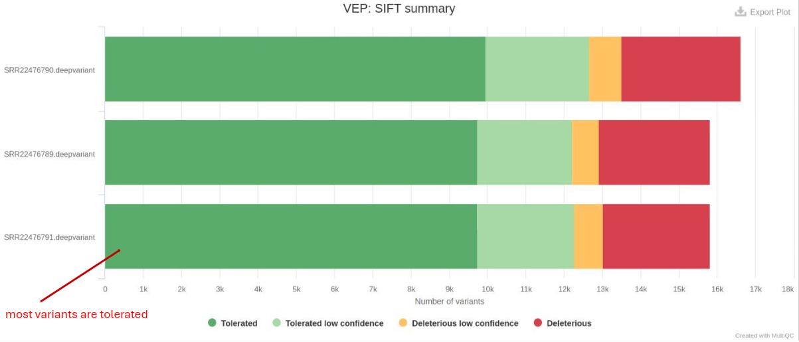

## Pipeline Information

This section details the methods and software used in the analysis:

### Methods Description

Describes the overall workflow and methodologies applied in the analysis, ensuring reproducibility and understanding of the process. 

### Software Versions

This section lists the versions of software used in this bioinformatic pipeline. This should help you in writing the methods section of your publication or if you wish to carry out some of the analysis on your own. We have written a template to help you with the method section of your manuscript. 

### Workflow Summary

This section lists some important parameters of this particular study. This often includes which reference genome is used, how the preprocessing was done, and also PCGR subworkflow option. 
