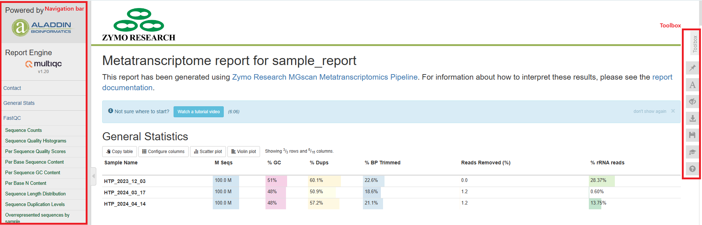
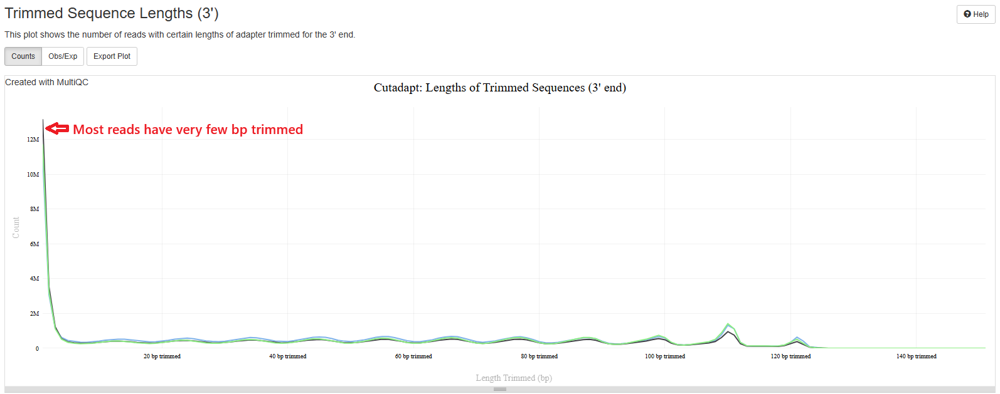
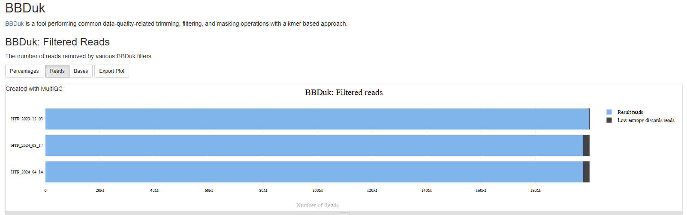
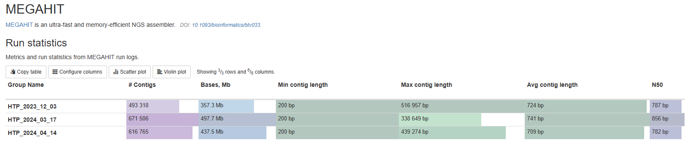
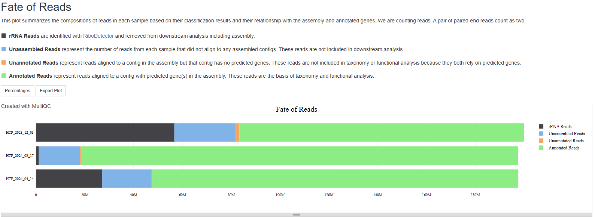
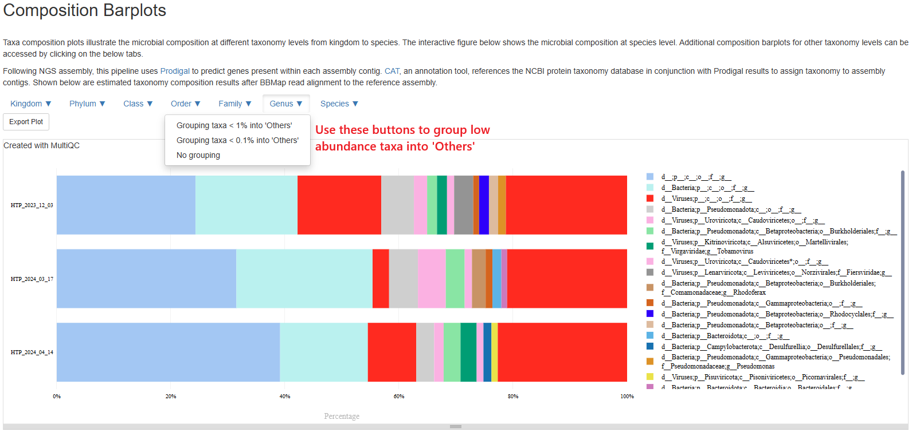
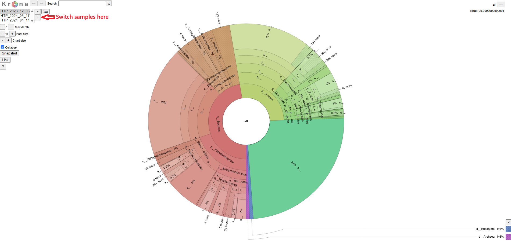

# How to interpret the metatranscriptome report
This document describes how to understand the bioinformatics report generated by [MGscan Metatranscriptome pipeline](https://github.com/Zymo-Research/aladdin-metatranscriptome-assembly). Most of the plots are taken from the [sample report](https://zymo-research.github.io/pipeline-resources/reports/metatranscriptome_sample_report.html). The sample report was generated using a small number of samples downsampled to 100 million reads per sample from [this paper](https://papers.ssrn.com/sol3/papers.cfm?abstract_id=5187186). The plots in your report might look a little different.

## Table of contents
* [Table of contents](#table-of-contents)
* [Report overview](#report-overview)
* [General statistics table](#general-statistics-table)
* [FastQC](#fastqc)
* [Cutadapt](#cutadapt)
* [BBDuk](#bbduk)
* [MEGAHIT](#megahit)
* [Fate of reads](#fate-of-reads)
* [Composition Barplots](#composition-barplots)
* [Software versions](#software-versions)
* [Workflow summary](#workflow-summary)

## Report overview
The bioinformatics report is generated using [`MultiQC`](https://multiqc.info/). There are general instructions on how to use a MultiQC report on [MultiQC website](https://multiqc.info/). The report itself also includes a link to a instructional video at the top of the report. In general, the report has a navigation bar to the left, which allows you to quickly navigate to one of many sections in the report. On the right side, there is a toolbox that allows to customize the appearance of your report and export figures and/or data. Most sections of the report are interactive. The plots will show you the sample name and values when you mouse over them.

## General statistics table
[The general statistics table](https://zymo-research.github.io/pipeline-resources/reports/metatranscriptome_sample_report.html#general_stats) gives an overview of some important stats of your samples. They include some statistics of the input files, such as how many reads are in each sample, duplication rate, and GC contents of the reads. They also tell you how much of the base-pairs were removed during the trimming step (`% BP Trimmed`) and percentages of reads removed during low-complexity filtering step (`Reads Removed(%)`). One important stat is how much of your reads were of rRNA origin (`% rRNA reads`). These reads are not used in the assembly step or any analysis that follows.  
A good metatranscriptome sequencing library should have most reads pass QC, with few low-complexity reads. The percentages of rRNA should be as low as possible, but given the complexity of the sample, sometimes a small amount of rRNA reads cannot be avoided.

## FastQC
FastQC is a read quality control tool that gives you various plots and stats about your sequencing quality. In this report, FastQC results on your raw reads are displayed. In short, they contain the following subsections:
1. Sequence Counts: number of unique and duplicate reads. It is normal to have some duplicate reads. A number of factors affect this, for example, low complexity samples, high rRNA content, low RNA input, etc.
2. Sequence Quanlity Histograms: quality scores of the reads at different positions. You want most of the reads to have above Q30, but if there are low quality at the ends in the plot, don't worry, they will get trimmed.
3. Per Sequence Quality Scores: average quality scores of the reads. You want most reads to be above Q30.
4. Per Base Sequence Content: a composition of the nucleotides at each position. Ideally, they should be pretty even throughout, however, it is normal to have some uneveness at the 5' or 3' region because of bias or artifacts in the library kits. As long as all samples in your study have similar behavior, this is usually acceptable.
5. Per Sequence GC content: GC content distribution of reads. Because metatranscriptome samples consist of different organisms of different GC contents, and when some of them account for a large percentage of the community, they may cause peaks in the GC content plot. Therefore, it is normal to have warnings in this plot for metatranscriptome samples. However, sharp peaks might indicate low sample complexity.
6. Per Base N content: N% in the reads. This should be very low, otherwise your data have poor quality.
7. Sequence Length Distribution: distribution of read length. If you used Illumina sequencing, the read length should be uniform or close to uniform.
8. Sequence Duplication Levels: %reads with duplication levels. Most duplicated reads are expected to have low duplication levels, if you see samples with significant percentages of reads with high duplication levels, it could indicate high rRNA content or a problem in sample complexity.
9. Overrepresented sequences: You shouldn't expect these except for adapter sequences. If you see warnings, check the next subsection.
10. Top overrepresented sequences: This shows you the DNA sequence of overrepsented sequences, if any. If you see anything, they should mostly be sequencing adapters.
10. Adapter Content: a plot of adapter content at different positions, or a statement when adapter contents are low. High adapter content indicates short inserts in the sequencing library, which you should work to avoid in the library prep protocol. However, when this happens, unless the adpater contents are very very high, or your reads are short to begin with, the data should still be usable.
11. Status Checks: a summary of the above plots, red and yellow indicates different levels of warning. However, as we discussed above, some of the warnings are because of the nature of the metagenome samples. Warnings do not necessarily indicate problems. Please read other sections of the report to see if you can find explanations for these warnings.

You can find more detailed explanations of FastQC reports [here](https://www.bioinformatics.babraham.ac.uk/projects/fastqc/Help/3%20Analysis%20Modules/).

### Cutadapt
This pipeline uses [`TrimGalore`](https://github.com/FelixKrueger/TrimGalore), which is a wrapper of [`Cutadapt`](https://cutadapt.readthedocs.io/en/stable/), to trim sequencing adapters and low quality bases. You should expect to see a plot that starts high on low number of bp trimmed (left side) and quickly flattens. This means most of your reads have very few base pairs being removed. If you see a plot with high number of reads being trimmed at high bp, it could mean your library insert is really short or your sequencing quality is really poor. 

### BBDuk
The [BBDuk](https://jgi.doe.gov/data-and-tools/software-tools/bbtools/bb-tools-user-guide/bbduk-guide/) section summarizes how many reads are filtered out because of low complexity or "low entropy". These reads are highly likely to be derived from technical artifacts. You should expect the percentages of such reads to be very low.

### MEGAHIT
By default, the pipeline uses [`Megahit`](https://github.com/voutcn/megahit) to conduct *de novo* assembly of metatranscriptome. This section gives you some stats of each assembly. They include, from left to right:
1. How many contigs are in each assembly.
2. Total bases of the assembly.
3. Minimum contig lengths.
4. Maximum contig lengths.
5. Average contig lengths.
6. N50 contig lengths. N50 is defined as the length of the contig at which 50% of the assembly is contained in contigs of that length or longer.

This stats help you quickly evaluate and compare assemblies. The total number and length of the contigs tell you the biological complexity of your samples. If two samples have similar sequencing depth and quality, but one with much larger assembly, that samples is likely more complex and diverse. The N50 number is a good evaluator of how fragmented your data is. A number of factors affects this, such as sequencing depth, sample complexity, assembly methods, etc. A good number for a bacterial metatranscriptome sample is 600-1000bp. If you see N50 significantly below that, it means your assembly contain a large number of very short contigs, which are less informative in taxonomy and function. You might want to consider increase sequencing depth, troubleshoot library prep, or both.

### Fate of reads
The section summarizes what happens to your reads after they are preprocessed, i.e., after the low complexity read removal step. There are four categories:
1. rRNA Reads are identified with [`RiboDetector`](https://github.com/hzi-bifo/RiboDetector) and removed from downstream analysis including assembly.
2. Unassembled Reads represent the number of reads from each sample that did not align to any assembled contigs. These reads are not included in downstream analysis.
3. Unannotated Reads represent reads aligned to a contig in the assembly but that contig has no predicted genes. These reads are not included in taxonomy or functional analysis because they both rely on predicted genes.
4. Annotated Reads represent reads aligned to a contig with predicted gene(s) in the assembly. These reads are the basis of taxonomy and functional analysis.

This plot is not commonly included in metatranscriptome pipelines, but we believe it could be very informative. For example, high rRNA reads obviously points to a rRNA depletion problem in library prep. High percentage of unassembled reads indicates the sequencing depth is inadequate to allow assemblies for low abundance organisms. Such bias against low abundance organism should be considered when evaluating a sample's taxonomic and functional profile. Of course, you want the percentage of annotated reads to be as high as possible. The information in this plot, combined with stats in the "MEGAHIT" section, help you understand your samples/assemblies better. For example, if a sample has low N50 number, high percentage of unassembled reads, increasing sequencing depth is likely advised to achieve better assembly.

### Composition Barplots
This section allows you to investigate the composition of every sample on different taxonomy levels. **Please note, this section can be slow to load. Please be patient.** The plot starts with a species-level presentation that include all species. It could be very busy and not very informative. That is why we've made the plot interactive where you could switch to different taxonomy levels, and group less abundant taxa into an "Others" category. Please click the buttons at the top left corner of the plot to customize your view. For example, below is a presentation at Genus level with genera below 1% grouped into "Others". Taxa labelled with "g__", "f__" means we couldn't confidently assign a genus, a family, and so on. Taxa "d__;p__;c__;o__;f__;g__" means the pipeline couldn't assign any taxonomy to those sequences. Often they don't have any hits in the entire NCBI NR database.

The pipeline also prosent the same information in a different format using [Krona](https://github.com/marbl/Krona/wiki/KronaTools), which is easier to browse and navigate. You can download the Krona report on Aladdin platform. A screenshot of that report is shown here.

### Software versions
This section lists the versions of software used in this bioinformatic pipeline. This should help you in writing the methods section of your publication or if you wish to carry out some of the analysis on your own.

### Workflow summary
This section lists any parameter that were different from the default values. For default values, please refer to the [pipeline code](https://github.com/Zymo-Research/aladdin-metatranscriptome-assembly). 
