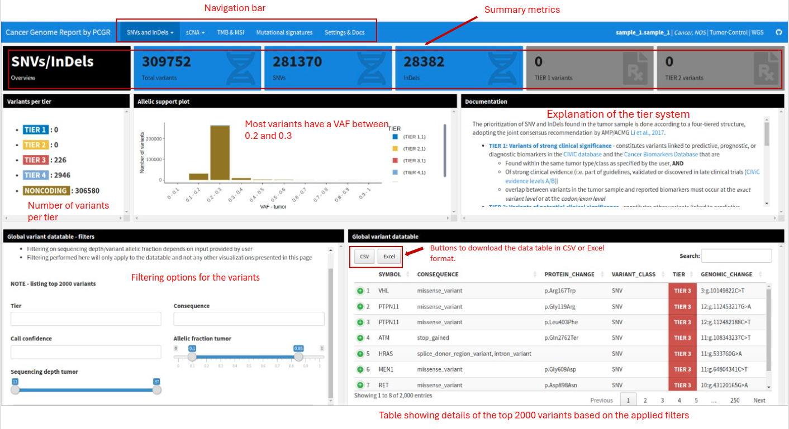

# How to Read the PCGR Report

[The Personal Cancer Genome Reporter (PCGR)](https://github.com/sigven/pcgr) is a comprehensive tool designed to analyze genetic variants found in tumor samples. This guide will help you understand the various sections of the report and how to interpret the information provided. The sample report could be found [here](../reports/pcgr_sample_report.html).

For further information, please check out the following resources:
- [PCGR Output Documentation](https://sigven.github.io/pcgr/articles/output.html)
- [PCGR Annotation Resources](https://sigven.github.io/pcgr/articles/annotation_resources.html)

## Overview of the PCGR Report

The PCGR report provides insights into Single Nucleotide Variants (SNVs) and Insertions/Deletions (InDels) detected in a cancer sample. It categorizes these variants based on their potential clinical significance and provides detailed information on each variant.

## Key Sections of the PCGR Report

## Interpreting the Report

### Header and Navigation
- **Title**: "Cancer Genome Report by PCGR"
- **Navigation Tabs**:
  - `SNVs and InDels`
  - `sCNA` (somatic Copy Number Alterations)
  - `TMB & MSI` (Tumor Mutational Burden & Microsatellite Instability)
  - `Mutational Signatures`
  - `Settings & Docs`

### Summary Metrics
- **Total Variants**: The total number of variants detected in the sample.
- **SNVs**: The number of Single Nucleotide Variants.
- **InDels**: The number of Insertions/Deletions.
- **TIER 1 Variants**: Variants of strong clinical significance.
- **TIER 2 Variants**: Variants of potential clinical significance.

### Clinical Significance Tiers
- **TIER 1**: Variants of strong clinical significance, often linked to known cancer treatments or prognostics.
- **TIER 2**: Variants with potential clinical significance, requiring further investigation.
- **TIER 3**: Variants of uncertain clinical significance, generally not immediately actionable.
- **TIER 4**: Other variants, typically noncoding or of unknown impact.
- **NONCODING**: Noncoding variants that do not affect protein-coding regions.

### Allelic Support Plot
- Use the VAF distribution to understand the proportion of tumor cells carrying each variant. High VAF suggests the variant is present in a large proportion of tumor cells, which might indicate clonal evolution.

### Filtering and Analysis
- Apply filters to narrow down the list of variants to those most relevant for your analysis.
  - **Tier Filter**: Focus on variants with higher clinical significance.
  - **Consequence Filter**: Select specific types of variants, such as those affecting protein function.
  - **Call Confidence**: Confidence level of variant calls.
  - **Allelic Fraction Filter**: Identify variants present at specific frequencies within the tumor.
  - **Sequencing Depth Filter**: Ensure the reliability of variant calls based on sequencing depth.

### Downloading Data
- Export the filtered variant data for further analysis or integration with other datasets using the CSV or Excel formats.