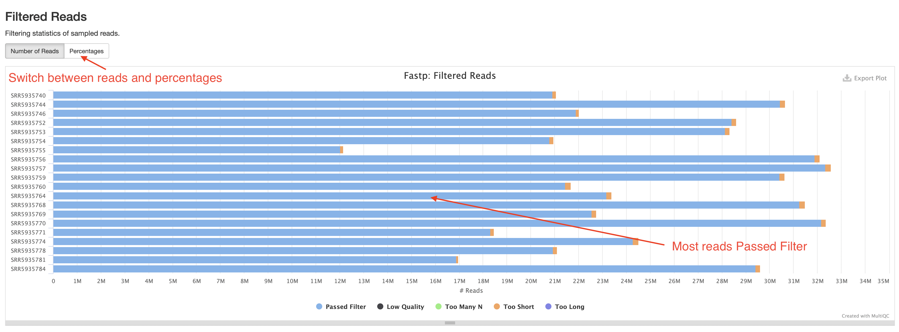
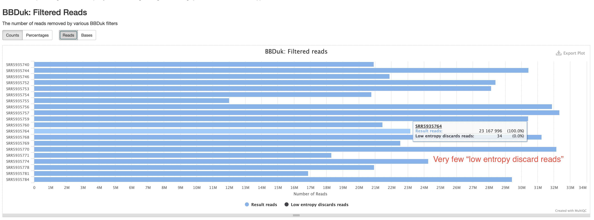
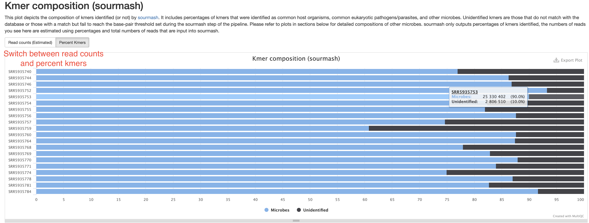
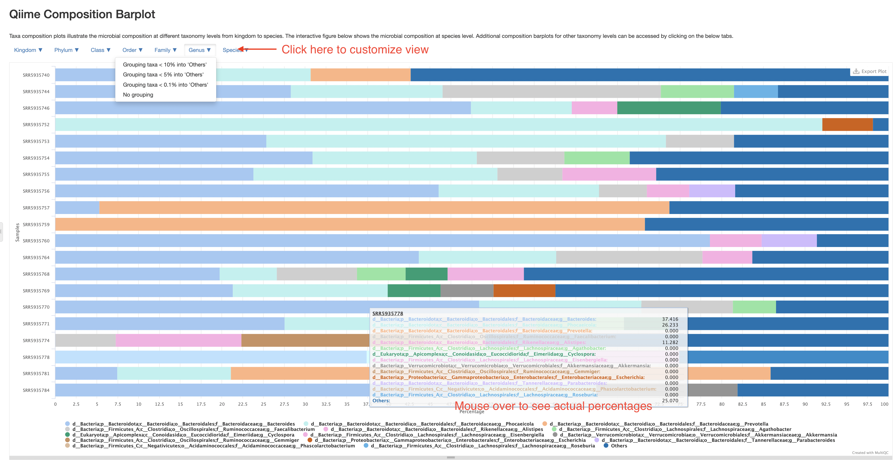
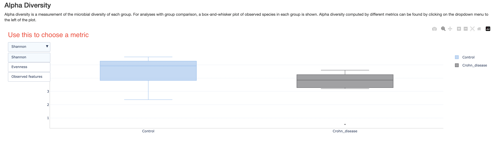
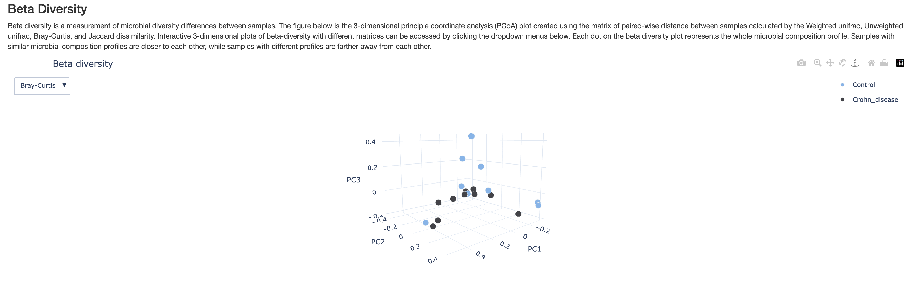
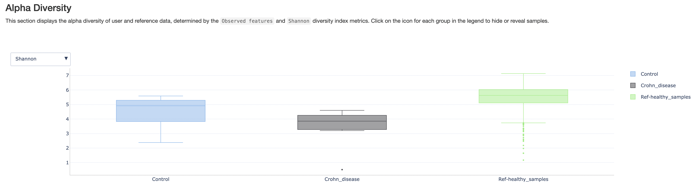
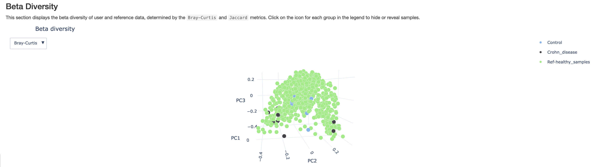

# How to interpret the shotgun report
This document describes how to understand the bioinformatics report generated by [Aladdin shotgun pipeline](https://github.com/Zymo-Research/aladdin-shotgun). Most of the plots are taken from the [sample report](https://zymo-research.github.io/pipeline-resources/reports/shotgun_sample_report.html). The sample report was generated using a small number of samples from [this paper](https://pubmed.ncbi.nlm.nih.gov/35614211). The plots in your report might look a little different.

## Table of contents
* [Table of contents](#table-of-contents)
* [Report overview](#report-overview)
* [General statistics table](#general-statistics-table)
* [Sample processing](#sample-processing)
  * [FastQC/Falco](#fastqc/falco)
  * [fastp](#fastp)
  * [BBDuk](#bbduk)
  * [Kmer composition](#kmer-composition-sourmash)
  * [Qiime composition barplot](#qiime-composition-barplot)
  * [Taxonomy abundance heatmap](#taxonomy-abundance-heatmap)
* [Diversity analysis](#diversity-analysis)
  * [Alpha diversity](#alpha-diversity)
  * [Alpha rarefaction](#alpha-rarefaction)
  * [Beta diversity](#beta-diversity)
* [Comparative diversity analysis](#comparative-diversity-analysis)
  * [Alpha diversity compared with reference](#alpha-diversity-compared-with-reference)
  * [Beta diversity compared with reference](#beta-diversity-compared-with-reference)
* [Pipeline information](#pipeline-information)
  * [Software versions](#software-versions)
  * [Workflow summary](#workflow-summary)

## Report overview
The bioinformatics report is generated using [`MultiQC`](https://multiqc.info/). There are general instructions on how to use a MultiQC report on [MultiQC website](https://multiqc.info/). The report itself also includes a link to a instructional video at the top of the report. In general, the report has a navigation bar to the left, which allows you to quickly navigate to one of many sections in the report. On the right side, there is a toolbox that allows to customize the appearance of your report and export figures and/or data. Most sections of the report are interactive. The plots will show you the sample name and values when you mouse over them.

## General statistics table
[The general statistics table](https://zymo-research.github.io/pipeline-resources/reports/shotgun_sample_report.html#general_stats) gives an overview of some important stats of your samples. They include some statistics of the input files, such as how many reads are in each sample, the lengths, duplication rate, and GC contents of the reads. They also tell you how many of your reads passed read quality QC (`% Pass QC Reads` and `No. Processed Reads`), the percentage of reads that are of low complexity and therefore filtered (`% Low-complexity Reads`), and most importantly, percentages of reads/kmers that have assigned taxonomy (`% Kmers w/ Taxonomy`). The default `sourmash` method assigns taxonomy to kmers, instead of reads. But since kmers are generated from reads, the percentages of kmers with taxonomy can be approximated to percentages of reads with assigned with taxonomy. 
A good shotgun sequencing library should have most reads pass QC, with few low-complexity reads. Most well-studied bacterial community, such as human gut microbiome samples, should have most reads with taxonomy assigned. A low taxonomy assignment rate could suggest possible host DNA contamination, which you will be able to investigate in a later chart. Some poorly-understood microbial communities could have unknown microbes without representations in the database, which could lead to low taxonomy assignment rate.

## Sample processing

### FastQC/Falco
There are two FastQC/Falco sections in the report, a pre-trimming and a post-trimming one. They contain charts and stats about the quality of the reads before and after read trimming step. If the library and sequencing qualities are good, these two sections are usually highly similar. In short, they contain the following subsections:
1. Sequence Counts: number of unique and duplicate reads. It is normal to have some duplicate reads, as long as they don't account for more than half of the reads. Even then, it could be explained by the nature of the sample, for example, low complexity samples, low DNA input, etc.
2. Sequence Quanlity Histograms: quality scores of the reads at different positions. You want most of the reads to have above Q30, but if there are low quality at the ends in the pre-trimming plot, don't worry, they will get trimmed.
3. Per Sequence Quality Scores: average quality scores of the reads. You want most reads to be above Q30.
4. Per Base Sequence Content: a composition of the nucleotides at each position. Ideally, they should be pretty even throughout, however, it is normal to have some uneveness at the 5' or 3' region because of bias or artifacts in the library kits. As long as all samples in your study have similar behavior, this is usually acceptable.
5. Per Sequence GC content: GC content distribution of reads. Because a metagenome samples consist of different organisms of different GC contents, and when some of them account for a large percentage of the community, they may cause peaks in the GC content plot. Therefore, it is normal to have warnings in this plot for metagenome samples.
6. Per Base N content: N% in the reads. This should be very low, otherwise your data have poor quality.
7. Sequence Length Distribution: distribution of read length. Pre-trimming, the read lengths should be pretty uniform. Post-trimming, if your reads have a lot of adapters, they could vary in lengths.
8. Sequence Duplication Levels: %reads with duplication levels. Most duplicated reads are expected to have low duplication levels, if you see samples with significant percentages of reads with high duplication levels, it could indicate a problem in library prep. However, sometimes it could be explained by a really dominant species in the sample.
9. Overrepresented sequences: You shouldn't expect these except for adapter sequences. If you see warnings, check the next subsection.
10. Adapter Content: a plot of adapter content at different positions, or a statement when adapter contents are low. High adapter content indicates short inserts in the sequencing library, which you should work to avoid in the library prep protocol. However, when this happens, unless the adpater contents are very very high, or your reads are short to begin with, the data should still be usable. There should be no adapter left in the post-trimming section though.
11. Status Checks: a summary of the above plots, red and yellow indicates different levels of warning. However, as we discussed above, some of the warnings are because of the nature of the metagenome samples. Warnings do not necessarily indicate problems. Please read other sections of the report to see if you can find explanations for these warnings.

You can find more detailed explanations of FastQC reports [here](https://www.bioinformatics.babraham.ac.uk/projects/fastqc/Help/3%20Analysis%20Modules/).

### fastp
The [fastp](https://github.com/OpenGene/fastp) section of the report contains stats of the read trimming step and some plots of read quality. Since the read quality portion are already covered by FastQC/Falco sections, you could simply skip them (we may elect to not include them in a future version). The most important plot here is the "Filtered Reads" barplot. You should expect most reads to be "Passed Filter".

### BBDuk
The [BBDuk](https://jgi.doe.gov/data-and-tools/software-tools/bbtools/bb-tools-user-guide/bbduk-guide/) section summarizes how many reads are filtered out because of low complexity or "low entropy". These reads are highly likely to be derived from technical artifacts. You should expect the percentages of such reads to be very low.

### Kmer composition (sourmash)
This section summarizes the percentages of kmers, or by approximation, the numbers of reads assigned with taxonomy. Those without any taxonomy assignment are labeled as "Unidentified", those coming from host sources or common eukaryotic pathogen will be labeled by their species name, for example, homo sapiens. All reads assigned to microbes will be combined and labeled "Microbes". This is supposed to give you a quick answers to a few questions:
1. Were there any host sequences in my sample and how much? This helps assess the sampling quality and how much of the sequencing data were useful.
2. Were there any eukaryotic pathogens detected?
3. How much of the reads have no assigned taxonomy. There could be several reasons for this. For example, they could be from organisms without representative genomes in the database. They could also be from species with very low abundance. This is because `sourmash` has a reporting threshold (default 50kb). Only species with enough reads to reach this threshold will have a reported kmer percentage. Low abundance species have fewer reads, which may result in their reads not reaching the threshold.

In the sample report, there are no host or pathogen sequences. If they are present in your samples, they will also show up in this plot. The samples here are all gut microbiome samples, which contain mostly well known organisms, therefore most of the kmers have assigned taxonomy.

### Qiime composition barplot
This section allows you to investigate the composition of every sample on different taxonomy levels. **Please note, these composition barplot only accounts for reads/kmers assigned to microbes, those from hosts or without assigned taxonomy have already been excluded. Therefore, the percentages presented here are "percentage among known microbial reads", not "percentage of all reads".** The plot starts with a species-level presentation that include all species. It could be very busy and not very informative. That is why we've made the plot interactive where you could switch to different taxonomy levels, and group less abundant taxa into an "Others" category. Please click the buttons at the top left corner of the plot to customize your view. For example, below is a presentation at Genus level with genera below 5% grouped into "Others".

### Taxonomy abundance heatmap
This section presents the taxonomy abundance data in a heatmap format. This allows you to see the differences between the samples better. **Please note, the heatmap only includes up to the top 20 most abundant taxa at a given taxonomy level.** There are two different views of this heatmap. One is of relative abundance, in other words, same data as presented in the "Qiime composition barplot" section, this is useful when you want to know the actual percentages of a given taxa. The other is log-transformed and centered data, which contrasts the changes between samples and taxa better. You can also customize the view at different taxonomy levels.

## Diversity analysis
**By default, these analyses are carried out at species level, unless specified otherwise when the pipeline was run.**

### Alpha diversity
This section shows a box plot of the alpha diversities of samples in each group, if group labels are provided. There are three different metrics for alpha diversity. Those can be chosen with the dropdown box on the top left corner. This plot intends to show whether one group of samples is more diverse than others. 

### Alpha rarefaction
This section shows changes in diversity in each group if there were fewer reads. This is only about species diversity, but shotgun sequencing is more than that, it often tries to detect genomic contents of the species as well. This may be removed in the future version. 

### Beta Diversity
This 3-D plot displays principle coordinate analysis results calculated using the beta diversity distances between samples. There are two different beta diversity metrics. You can spin the plot to view at different angles. This plot is intended to show you how similar or disimilar are samples of different groups. You may expect samples of the same group to be more similar to each other, but that may not always be true.

## Comparative diversity analysis
>**This section is experimental and under development!**
This section is very similar to the "Diversity analysis" section, except that in addition to user provided samples, a large cohort of reference samples are added in the diversity analysis. In this sample report, the reference dataset is a collection of healthy human gut microbiome samples from both public data and private data from Zymo Research. The hope is that it can provide a large number and therefore more complete picture of healthy human gut microbiome than a typical "control" group in a study. This function can be useful when user have limited number of samples but want something to compare to. The comparison here is crude considering there may be batch effects, protocol biases, and other factors in the reference dataset. We welcome suggestions to improve this part of the pipeline/report.

### Alpha diversity compared with reference
This is the same plot as the alpha diversity plot above, but with the reference samples added. As you can see, the reference dataset has a wide range of alpha diversity, but is consistent in showing that most healthy samples have higher alpha diversity than the samples with Crohn disease.

### Beta diversity compared with reference
This is the same plot as the beta diversity plot above, but with the reference samples added. The placement of the diseased samples are not outside of all healthy samples, but you can see that they are more on the edge, while the control samples are closer to the center and the majority of the reference healthy samples. It may be that the subtle differences between the disease and healthy samples are not obvious in this specific method of plotting.

## Pipeline information

### Software versions
This section lists the versions of software used in this bioinformatic pipeline. This should help you in writing the methods section of your publication or if you wish to carry out some of the analysis on your own.

### Workflow summary
This section lists any parameter that were different from the default values. For default values, please refer to the [pipeline code](https://github.com/Zymo-Research/aladdin-shotgun). 